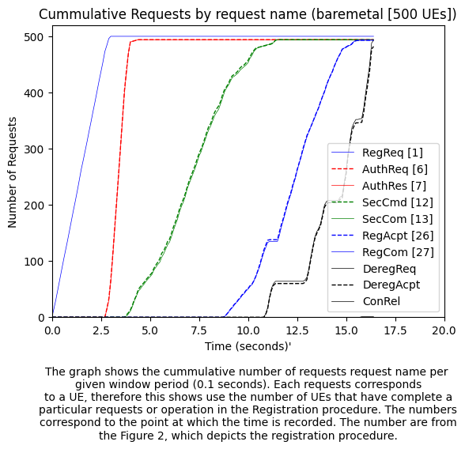
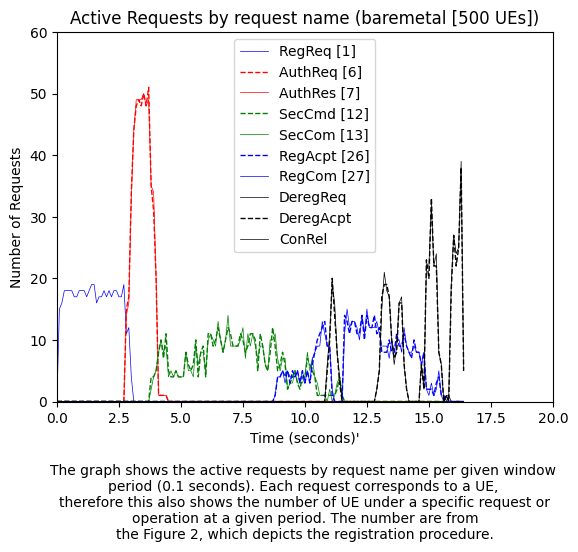
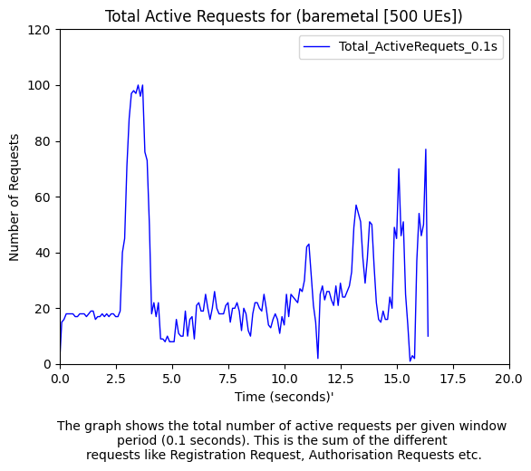

# Mobile core network traffic generator

The project implements a traffic generator for 5G Core Network. The traffic generator has the following features:
1. UE emulation - mobile phone
2. gNodeB emulation - NGAP layer
3. gNodeB emulation - GTPU protocol
4. Load testing of control traffic
5. Load testing of user plane traffic
6. Validation/Compliance testing of 5GC responses (WIP)

UE Features
1. Initial registration
2. Primary Authentication and Key Agreement
2. Security Mode Control
3. UE initiated PDU session establishment
3. UE initiated De-registration

NGAP Features
1. NG Setup
2. Initial Context Setup
3. Initial UE Message
4. Downlink NAS Transport
5. Uplink NAS Transport
6. PDU Session Resource Setup
7. UE Connection Release

## Installing 5GC traffic generator

```bash
# initialize your local configuration file
git submodule init
# fetch all the data from that submodule
git submodule update
```

- pycrate `pip install pycrate`
- headers for pysctp `sudo apt-get install python3-dev`
- pysctp `pip install pysctp`
- scapy `pip install scapy`
- pyroute2 `pip install pyroute2`
- bcc `sudo apt-get install python3-bpfcc bpfcc-tools linux-headers-$(uname -r)`
- libbpf `sudo apt-get install libbpf-dev`
- clang `sudo apt-get install clang-14 && sudo ln /usr/bin/clang-14 /usr/bin/clang`
- setuptools `sudo apt install python3-setuptools`
- CryptoMobile (See the submodule for installation)
    - `pip install cryptography`
    - `sudo apt-get install build-essential`
    - `cd CryptoMobile && python3 setup.py install`
- pyyaml `pip install pyyaml`
- tabulate `pip install tabulate`

## Running the traffic generator

You will need to update the ip address in the files `src/config/open5gs-ue.yaml` and  `src/config/open5gs-gnb.yaml` on the core network VM. The config files are inspired by [UERANSIM](https://github.com/aligungr/UERANSIM)'s config files.

```bash
cd ~/cn-tg/

# usage: run.py [-h] [-i INTERVAL] [-u UE_CONFIG_FILE] [-g GNB_CONFIG_FILE] [-f FILE] [-v]

# Run 5G Core traffic generator

# optional arguments:
#   -h, --help            show this help message and exit
#   -i INTERVAL, --interval INTERVAL
#                         Interval of adding UEs in seconds
#   -n NUM_PKTS, --num_pkts NUM_PKTS
#                         Number of UP packets to send per second
#   -u UE_CONFIG_FILE, --ue_config_file UE_CONFIG_FILE
#                         UE configuration file
#   -g GNB_CONFIG_FILE, --gnb_config_file GNB_CONFIG_FILE
#                         GNB configuration file
#   -f FILE, --file FILE  Log file directory
#   -v, --verbose         Increase verbosity (can be specified multiple times)
#   -s, --statistics      Enable print of statistics
#   -e, --ebpf            Load ebpf programs to collect and graph SCTP stats
#   -p, --period          Period/interval (seconds) for printing statistics

python3 run.py -u config/oai-cn5g-ue.yaml -g config/oai-cn5g-gnb.yaml -vvv
```

**Configuring the traffic generator to send IP packets**

After PDU session establishment, the traffic generator can generate and send UP traffic for each UE that has established a PDU session. This is achieved by updating the procedures list to include `5GSMPDUSessionTransmission` after `5GSMPDUSessionEstabRequest`, see the sample below. The generator will generate at most the number of packets per second provided above. The default is (1 << 20), meaning it will generate the most it can.

```yaml
...
    # Procedures: a list of UE initiated messages that trigger a given procedure
    procedures:
      - 5GMMRegistrationRequest
      - 5GSMPDUSessionEstabRequest
      - 5GSMPDUSessionTransmission
      - 5GMMMODeregistrationRequest
```

## Output

The traffic generator records the timestamp for each state transition for the UEs. This can be useful for analysing the performance of the Core Network, the computation cost of each prodecure, among other things. When the traffic genetaor exists, this information is stored in files `procedure_times_{cpu}` (since each CPU will act an an independent gNB). Below is a sample result analysis you can extract from the information.

<p align="center">
  
  
  
</p>

## Validation/Compliance testing of 5GC responses

The traffic generator can be used to validate responses from the core network. The response data is checked against what's stated in the 3GPP TS 24.501 version 15.7.0. To start validate increase the verbose of the generator: `vvvv` will print only failed validations and `vvvvv` will print all the validation results.

## Notes

For a tutorial on how to run or test the traffic generator with open source 5G networks see the [Performance study of Open Source 5G Core networks](docs/PERFORMANCE_STUDY_OF_5G_CORES.md) under docs folder.