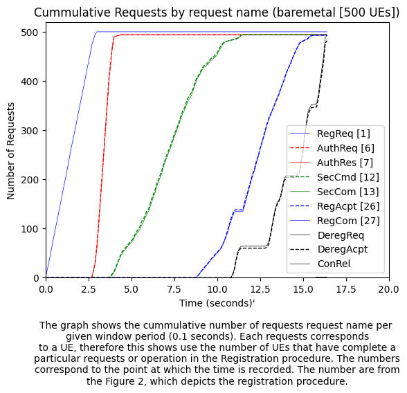
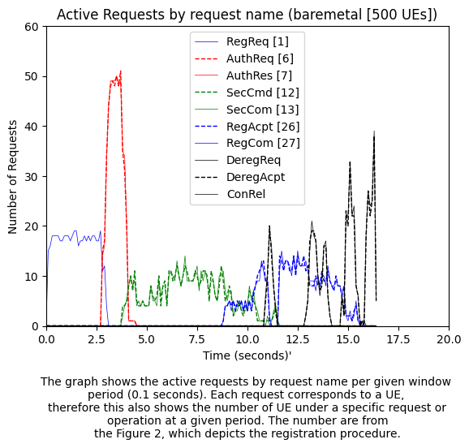
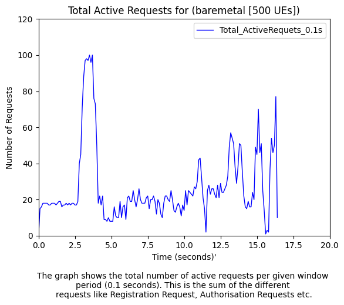
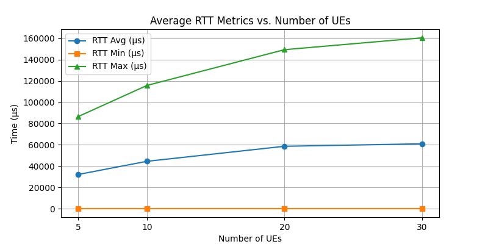
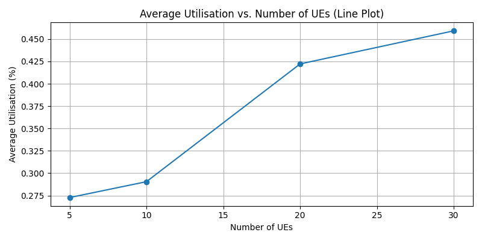
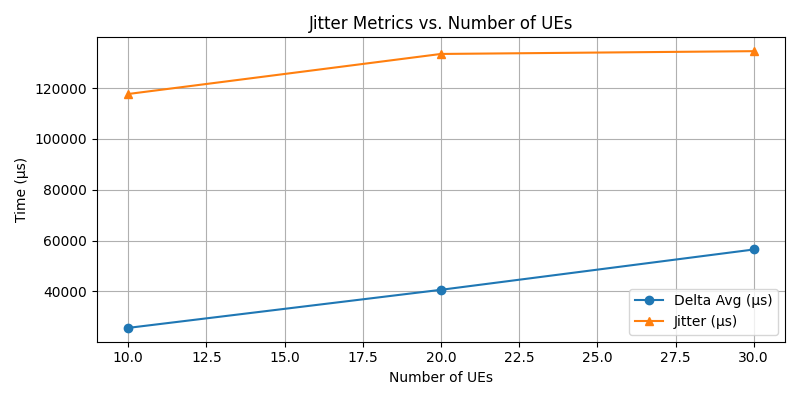
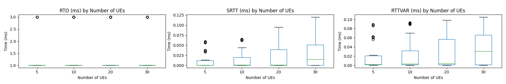

# Mobile core network traffic generator

A comprehensive traffic generator for 5G Core Network testing with features for UE/gNodeB emulation, control/user plane traffic generation, SCTP protocol analysis, and 5GC compliance validation.

## Features

UE Features
1. Initial registration
2. Primary Authentication and Key Agreement
2. Security Mode Control
3. UE initiated PDU session establishment
3. UE initiated De-registration

NGAP Features
1. NG Setup
2. Initial Context Setup
3. Initial UE Message
4. Downlink NAS Transport
5. Uplink NAS Transport
6. PDU Session Resource Setup
7. UE Connection Release

SCTP Analysis Features
1. Round Trip Time (RTT) measurement
2. Retransmission Timeout (RTO) monitoring
3. Buffer utilisation tracking
4. Stream usage analysis
5. Inter-packet jitter measurement

## Installing 5GC traffic generator

```bash
# Get dependencies
git submodule init && git submodule update

# Install required packages
sudo apt-get install python3-dev python3-bpfcc bpfcc-tools linux-headers-$(uname -r) libbpf-dev clang-14 python3-setuptools build-essential
sudo ln /usr/bin/clang-14 /usr/bin/clang

# Install Python packages
pip install pycrate pysctp scapy pyroute2 cryptography pyyaml tabulate

# Install CryptoMobile
cd CryptoMobile && python3 setup.py install
```

## Running the traffic generator

You will need to update the ip address in the files `src/config/open5gs-ue.yaml` and  `src/config/open5gs-gnb.yaml` on the core network VM. The config files are inspired by [UERANSIM](https://github.com/aligungr/UERANSIM)'s config files.

```bash
cd ~/cn-tg/

# usage: run.py [-h] [-i INTERVAL] [-u UE_CONFIG_FILE] [-g GNB_CONFIG_FILE] [-f FILE] [-v]

# Run 5G Core traffic generator

# optional arguments:
#   -h, --help            show this help message and exit
#   -i INTERVAL, --interval INTERVAL
#                         Interval of adding UEs in seconds
#   -n NUM_PKTS, --num_pkts NUM_PKTS
#                         Number of UP packets to send per second
#   -u UE_CONFIG_FILE, --ue_config_file UE_CONFIG_FILE
#                         UE configuration file
#   -g GNB_CONFIG_FILE, --gnb_config_file GNB_CONFIG_FILE
#                         GNB configuration file
#   -f FOLDER, --file FOLDER
#                         Folder to put the generated files (stats and logs)
#   -v, --verbose         Increase verbosity (can be specified multiple times)
#   -s, --statistics      Enable print of statistics
#   -e, --ebpf            Enable print of ebpf statistics
#   -p PERIOD, --period PERIOD
#                         Period/interval (seconds) for printing statistics
#   --sctp                Enable all SCTP tracing modules
#   --sctp-rtt            Enable SCTP RTT tracing
#   --sctp-rto            Enable SCTP RTO tracing
#   --sctp-bufmon         Enable SCTP buffer monitoring
#   --sctp-stream         Enable SCTP stream utilization analysis
#   --sctp-jitter         Enable SCTP jitter measurement

python3 run.py -u config/oai-cn5g-ue.yaml -g config/oai-cn5g-gnb.yaml -vvv
```

**Configuring the traffic generator to send IP packets**

After PDU session establishment, the traffic generator can generate and send UP traffic for each UE that has established a PDU session. This is achieved by updating the procedures list to include `5GSMPDUSessionTransmission` after `5GSMPDUSessionEstabRequest`, see the sample below. The generator will generate at most the number of packets per second provided above. The default is (1 << 20), meaning it will generate the most it can.

```yaml
...
    # Procedures: a list of UE initiated messages that trigger a given procedure
    procedures:
      - 5GMMRegistrationRequest
      - 5GSMPDUSessionEstabRequest
      - 5GSMPDUSessionTransmission
      - 5GMMMODeregistrationRequest
```

## Running the traffic generator using Docker Compose

You can also run the traffic generator using Docker Compose, which simplifies the process of setting up and running the required dependencies. Here's an example of how to run it with OAI CN and Free5GC:

**OAI CN**

```bash
cd docker-compose

docker compose -f docker-compose-oai.yaml  --profile oai up -d

# Wait ~10 seconds for UEs to be initiased in DB
docker compose -f docker-compose-oai.yaml  --profile cn-tg up -d

# See the logs with the NGAP and NAS messages
docker logs cn-tg
```

**free5GC**

```bash
cd docker-compose

docker compose -f docker-compose-free5gc.yaml  --profile free5gc up -d

# Wait ~10 seconds for UEs to be initiased in DB
docker compose -f docker-compose-free5gc.yaml  --profile cn-tg up -d

# See the logs with the NGAP and NAS messages
docker logs cn-tg
```

## Output

The traffic generator records the timestamp for each state transition for the UEs. This can be useful for analysing the performance of the Core Network, the computation cost of each prodecure, among other things. When the traffic genetaor exists, this information is stored in files `procedure_times_{cpu}` (since each CPU will act an an independent gNB). The SCTP tracing tools generate data that can be visualised to understand protocol behavior.

Below is a sample result analysis you can extract from the information.

<p align="center">
  
  
  
   
  
  <!--  -->
  
  
</p>

## Validation/Compliance testing of 5GC responses

The traffic generator can be used to validate responses from the core network. The response data is checked against what's stated in the 3GPP TS 24.501 version 15.7.0. To start validate increase the verbose of the generator: `vvvv` will print only failed validations and `vvvvv` will print all the validation results.

## Notes

For a tutorial on how to run or test the traffic generator with open source 5G networks see the [Performance study of Open Source 5G Core networks](docs/PERFORMANCE_STUDY_OF_5G_CORES.md) under docs folder.
